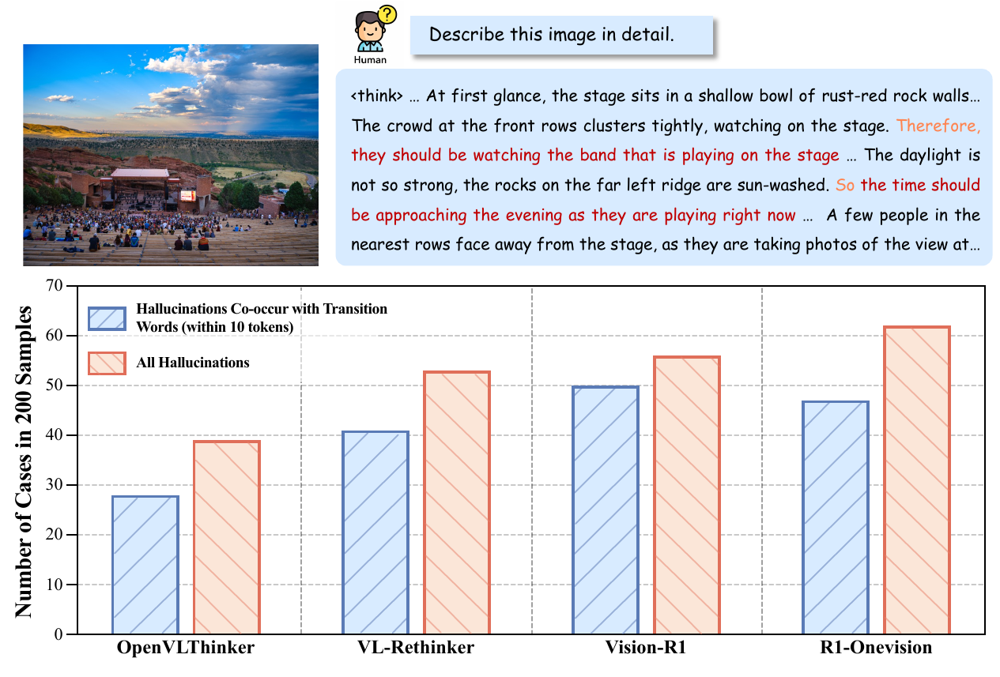
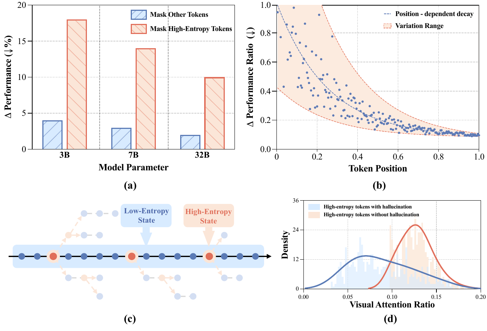
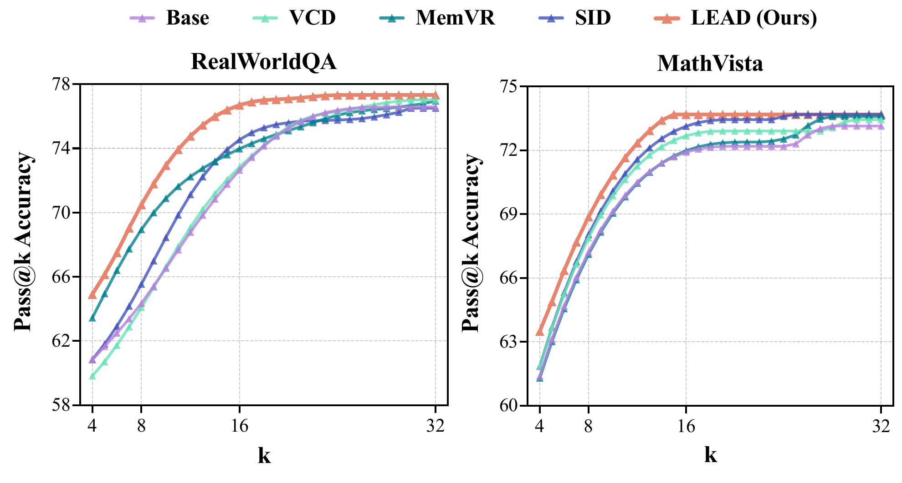
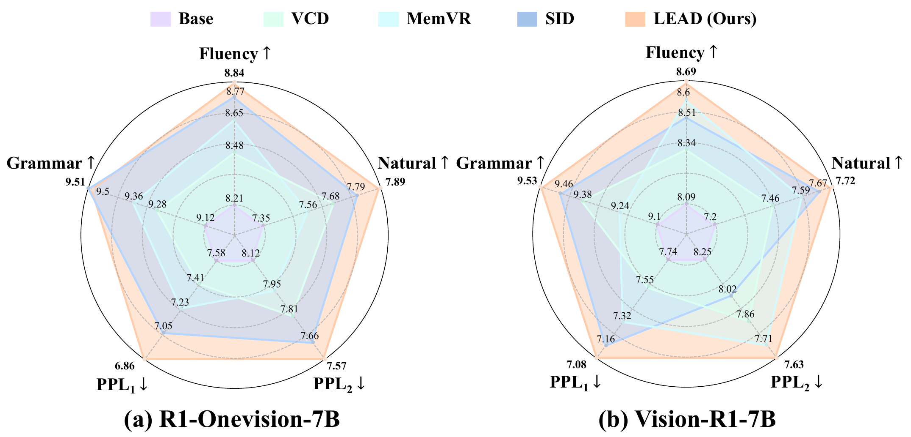
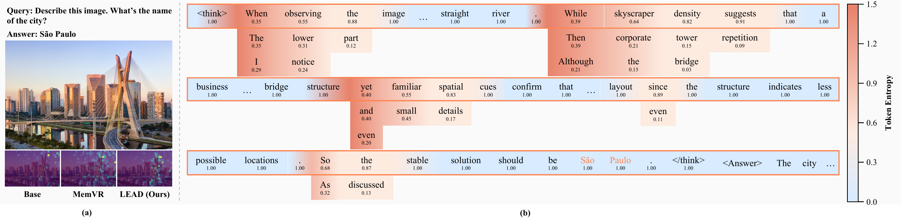

<div align="center">

# LEAD: Latent Entropy-Aware Decoding

### Thinking in Uncertainty: Mitigating Hallucinations in MLRMs with Latent Entropy-Aware Decoding

[]()
[](https://arxiv.org/abs/xxxx.xxxxx)
[](LICENSE)
[](https://zhongxing-xu.github.io/LEAD)

**Zhongxing Xu, Zhonghua Wang, Zhe Qian, Dachuan Shi, Feilong Tang, Ming Hu,**
**Shiyan Su, Xiaocheng Zou, Wei Feng, Dwarikanath Mahapatra, Yifan Peng, Mingquan Lin, Zongyuan Ge**

**🎉 本文已被 CVPR 2026 接收！**

</div>

---

## 📌 概述

**LEAD**（Latent Entropy-Aware Decoding）是一种 **无需训练（training-free）** 的解码策略，旨在缓解多模态大推理模型（MLRMs）中的幻觉问题。LEAD 通过实时监测 token 概率分布的熵值，自适应地在 **潜在解码（latent decoding）** 和 **离散解码（discrete decoding）** 之间动态切换，并在高不确定性节点注入视觉锚点以强化视觉 grounding。

<div align="center">

</div>

<p align="center"><em>LEAD 框架：在高熵阶段使用概率加权的连续 embedding 保留多候选语义，在低熵阶段切回标准离散 token 解码以保证稳定收敛。</em></p>

---

## 🔥 最新动态

- **[2026/03]** 🎉 LEAD 被 **CVPR 2026** 接收！
- **[2026/03]** 代码和数据集已开源。

---

## 💡 核心亮点

- **🔍 关键发现**：转折词（"however"、"but"、"so"等）与高熵推理状态高度相关，幻觉往往在这些节点之后更容易出现。
- **🧠 熵感知切换**：高熵阶段采用概率加权的连续 embedding 进行 latent reasoning；低熵阶段恢复离散 token decoding 保证收敛性。
- **🖼️ 视觉锚点注入**：在不确定推理的关键时刻注入视觉 anchor token，减少模型脱离图像内容的"脑补式"推理。
- **⚡ 即插即用**：无需额外训练或外部工具，可直接应用于现有 MLRMs。

---

## 📊 关键发现与动机

### 幻觉与高熵推理状态的关联

在多模态大推理模型中，幻觉与推理过程中的高熵节点（如转折词附近）密切相关。统计分析表明，大部分幻觉都集中在这些 transition words 附近出现。

<div align="center">

</div>

<p align="center"><em>（上）幻觉通常在转折词之后出现；（下）幻觉与 transition words 的共现统计。</em></p>

### Token 级熵分析

高熵 token 是决定后续推理方向的关键节点。进一步分析揭示：(a) 高熵 token 对最终性能的影响远大于普通 token；(b) 越早出现的高熵 token 对推理轨迹的影响越大；(c) 在高不确定推理状态和低不确定推理状态之间存在明显的交替模式；(d) 与幻觉相关的高熵 token 通常具有更低的视觉注意力比率。

<div align="center">

</div>

---

## 📈 实验结果

LEAD 在多个维度上展现出稳定且显著的收益。

### 推理效率

LEAD 以 **更短的推理长度** 获得 **更高的准确率**，说明 latent reasoning 提高了思考效率而非增加冗余。

<div align="center">

</div>

### 采样效率 (Pass@k)

LEAD 的 Pass@k 曲线整体高于对比方法，以更少的采样次数更早达到高精度区间。

<div align="center">

</div>

### 文本质量

LEAD 在 Fluency、Naturalness、Grammar 以及 PPL 等指标上保持稳定甚至更优，不会以牺牲文本质量为代价换取准确率。

<div align="center">

</div>

### 消融研究

动态熵阈值（Δ）始终优于固定阈值策略；discrete reasoning window 的大小在中等范围（128）时效果最优。

<div align="center">

</div>

<div align="center">

</div>

### 可视化

LEAD 在关键推理步骤中维持更稳定的视觉注意力，同时保留更分散的 token 概率分布以支持探索性推理。

<div align="center">

</div>

---

## 🛠️ 环境配置

### 1. 克隆仓库

```bash
git clone https://github.com/Zhongxing-XU/LEAD.git
cd LEAD
```

### 2. 安装依赖

```bash
pip install -r requirements.txt
```

### 3. 准备模型权重

下载 [Qwen2.5-VL-7B-Instruct](https://huggingface.co/Qwen/Qwen2.5-VL-7B-Instruct)，或直接使用 HuggingFace 模型名自动下载：

```bash
# 方式 A：自动下载
--model_name Qwen/Qwen2.5-VL-7B-Instruct

# 方式 B：本地路径
--model_name /path/to/Qwen2.5-VL-7B-Instruct
```

---

## 🚀 快速开始

### Demo 示例

```bash
python main.py \
    --model_name Qwen/Qwen2.5-VL-7B-Instruct \
    --dataset data/demo.jsonl \
    --method lead \
    --max_new_tokens 2048
```

### 完整评测

```bash
bash script/run.sh
```

### 自定义配置

```bash
python main.py \
    --model_name Qwen/Qwen2.5-VL-7B-Instruct \
    --dataset data/physunibench.jsonl \
    --output_dir output \
    --method lead \
    --alpha 0.6 \
    --max_switch_count 5 \
    --temperature 0.6 \
    --top_p 0.95 \
    --top_k 20 \
    --max_new_tokens 25600 \
    --seed 42
```

---

## ⚙️ 参数说明

### 模型与数据

| 参数 | 默认值 | 说明 |
|------|--------|------|
| `--model_name` | `Qwen/Qwen2.5-VL-7B-Instruct` | HuggingFace 模型名或本地权重路径 |
| `--dataset` | `data/physunibench.jsonl` | 数据集 JSONL 文件路径 |
| `--output_dir` | `output/` | 结果保存目录 |
| `--limit` | `None` | 仅运行前 N 条样本（调试用） |

### 解码方法

| 参数 | 默认值 | 说明 |
|------|--------|------|
| `--method` | `lead` | 解码方法：`lead` / `cot` / `cot_greedy` |
| `--alpha` | `0.6` | Soft-mode 混合系数 α₀，越大越偏向概率加权 embedding |
| `--max_switch_count` | `5` | 最大 soft→normal 模式切换次数，超出后触发收敛注入 |

### 采样参数

| 参数 | 默认值 | 说明 |
|------|--------|------|
| `--temperature` | `0.6` | 采样温度 |
| `--top_p` | `0.95` | Nucleus sampling 阈值 |
| `--top_k` | `20` | Top-k 过滤 |
| `--max_new_tokens` | `25600` | 最大生成 token 数 |
| `--seed` | `42` | 随机种子 |

---

## 📁 可用脚本

| 脚本 | 说明 |
|------|------|
| `script/run.sh` | LEAD 方法完整评测 |
| `script/run_cot.sh` | CoT baseline 评测 |
| `script/run_debug.sh` | 调试模式：5 条样本、短生成 |
| `script/run_eval.sh` | 仅评估已有结果 |

---

## 📦 数据集格式

将 JSONL 文件放入 `data/` 目录，格式如下：

```json
{"id": 1, "image": "path/to/image.jpg", "question": "What is shown?", "options": "A. ...\nB. ...\nC. ...\nD. ...", "answer": "A"}
```

仓库内置以下 benchmark 数据集：

| 数据集 | 说明 |
|--------|------|
| `physunibench.jsonl` | PhysUniBench 物理推理 |
| `math_vision.jsonl` | MathVision 数学推理 |
| `math_vista.jsonl` | MathVista 视觉数学 |
| `mmvp.jsonl` | MMVP 视觉感知 |
| `realworldqa.jsonl` | RealWorldQA 真实场景推理 |
| `visulogic.jsonl` | VisuLogic 视觉逻辑 |
| `vstar.jsonl` | V* benchmark |
| `demo.jsonl` | 快速 Demo（1 条样本） |

---

## 🗂️ 项目结构

```
LEAD/
├── main.py                    # 主入口
├── lead/
│   ├── __init__.py
│   ├── generation_utils.py    # LEAD 和 CoT 核心生成算法
│   ├── inference.py           # 输入构造和单样本推理
│   ├── data.py                # 数据加载与预处理
│   ├── evaluator.py           # 答案评估与准确率统计
│   ├── prompts.py             # Prompt 模板管理
│   ├── logger.py              # 日志系统
│   └── utils.py               # 通用工具函数
├── data/                      # 数据集 JSONL 文件
├── figure/                    # 论文图表
├── example/                   # Demo 图片
├── script/                    # 运行脚本
├── tests/                     # 单元测试
├── requirements.txt
├── setup.py
├── LICENSE
└── CONTRIBUTING.md
```

---

## 📝 引用

如果本项目对你的研究有所帮助，请引用我们的论文：

```bibtex
@inproceedings{xu2026lead,
      title     = {Thinking in Uncertainty: Mitigating Hallucinations in MLRMs with Latent Entropy-Aware Decoding},
      author    = {Zhongxing Xu and Zhonghua Wang and Zhe Qian and Dachuan Shi and Feilong Tang and Ming Hu and Shiyan Su and Xiaocheng Zou and Wei Feng and Dwarikanath Mahapatra and Yifan Peng and Mingquan Lin and Zongyuan Ge},
      booktitle = {Proceedings of the IEEE/CVF Conference on Computer Vision and Pattern Recognition (CVPR)},
      year      = {2026}
}
```

---

## 📄 License

本项目基于 MIT License 开源 — 详见 [LICENSE](LICENSE) 文件。
