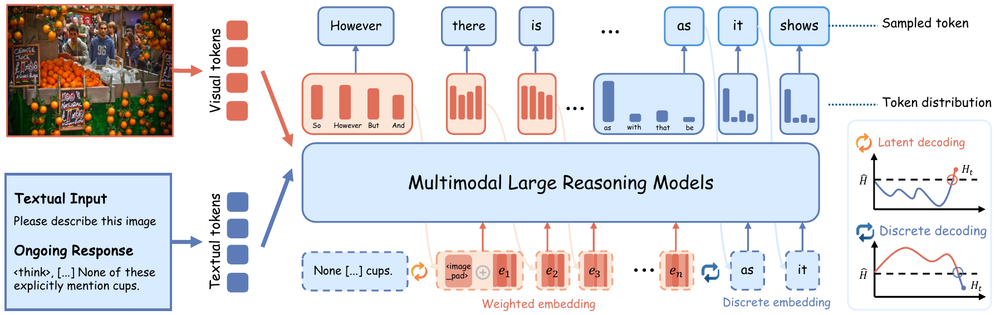

<div align="center">

# LEAD: Latent Entropy-Aware Decoding

### Thinking in Uncertainty: Mitigating Hallucinations in MLRMs with Latent Entropy-Aware Decoding

[]()
[](https://arxiv.org/abs/2603.13366)
[](LICENSE)
[](https://mlrm-lead.github.io/)


</div>

## 🔥 Latest Updates

- **[2026/01]** 🎉 LEAD was accepted to **CVPR 2026**!
- **[2026/03]** The code and datasets have been released.

---

## 📌 Overview

**LEAD** (Latent Entropy-Aware Decoding) is a **training-free** decoding strategy designed to mitigate hallucinations in Multimodal Large Reasoning Models (MLRMs). LEAD dynamically switches between **latent decoding** and **discrete decoding** by monitoring the entropy of token probability distributions in real time, and injects visual anchors at highly uncertain steps to strengthen visual grounding.

<div align="center">

</div>

## 💡 Key Highlights

- **Entropy-aware switching**: Uses probability-weighted continuous embeddings for latent reasoning during high-entropy stages, and returns to discrete token decoding during low-entropy stages to ensure convergence.
- **Visual anchor injection**: Injects visual anchor tokens at critical moments of uncertain reasoning to reduce image-detached hallucinated reasoning.
- **Plug-and-play**: Requires no additional training or external tools and can be directly applied to existing MLRMs.

---

## 🛠️ Setup

### 1. Clone the Repository

```bash
git clone https://github.com/Zhongxing-XU/LEAD.git
cd LEAD
```

### 2. Install Dependencies

```bash
pip install -r requirements.txt
```

### 3. Prepare Model Weights

Download [R1-Onevision-7B](https://huggingface.co/Fancy-MLLM/R1-Onevision-7B), or use the Hugging Face model name for automatic download:

```bash
# Option A: automatic download
--model_name Fancy-MLLM/R1-Onevision-7B

# Option B: local path
--model_name /path/to/R1-Onevision-7B
```

---

## 🚀 Quick Start

### Demo Example

```bash
python main.py \
    --model_name Fancy-MLLM/R1-Onevision-7B \
    --dataset data/demo.jsonl \
    --method lead \
    --max_new_tokens 2048
```

### Full Evaluation

```bash
bash script/run.sh
```

### Custom Configuration

```bash
python main.py \
    --model_name Fancy-MLLM/R1-Onevision-7B \
    --dataset data/physunibench.jsonl \
    --output_dir output \
    --method lead \
    --alpha 0.6 \
    --max_switch_count 5 \
    --temperature 0.6 \
    --top_p 0.95 \
    --top_k 20 \
    --max_new_tokens 25600 \
    --seed 42
```

---

## ⚙️ Arguments

### Model and Data

| Argument | Default | Description |
|------|--------|------|
| `--model_name` | `Fancy-MLLM/R1-Onevision-7B` | Hugging Face model name or local checkpoint path |
| `--dataset` | `data/physunibench.jsonl` | Path to the dataset JSONL file |
| `--output_dir` | `output/` | Directory for saving results |
| `--limit` | `None` | Run only the first N samples (for debugging) |

### Decoding Method

| Argument | Default | Description |
|------|--------|------|
| `--method` | `lead` | Decoding method: `lead` / `cot` / `cot_greedy` |
| `--alpha` | `0.6` | Soft-mode mixing coefficient α₀; larger values place more weight on probability-weighted embeddings |
| `--max_switch_count` | `5` | Maximum number of soft→normal mode switches before convergence injection is triggered |

### Sampling Parameters

| Argument | Default | Description |
|------|--------|------|
| `--temperature` | `0.6` | Sampling temperature |
| `--top_p` | `0.95` | Nucleus sampling threshold |
| `--top_k` | `20` | Top-k filtering |
| `--max_new_tokens` | `25600` | Maximum number of generated tokens |
| `--seed` | `42` | Random seed |

---

## 📁 Available Scripts

| Script | Description |
|------|------|
| `script/run.sh` | Full evaluation with the LEAD method |
| `script/run_cot.sh` | Evaluation of the CoT baseline |
| `script/run_debug.sh` | Debug mode: 5 samples with short generation |
| `script/run_eval.sh` | Evaluate existing results only |

---

## 📦 Dataset Format

Place the JSONL file in the `data/` directory using the following format:

```json
{"id": 1, "image": "path/to/image.jpg", "question": "What is shown?", "options": "A. ...\nB. ...\nC. ...\nD. ...", "answer": "A"}
```

Built-in benchmark datasets: `physunibench`, `math_vision`, `math_vista`, `mmvp`, `realworldqa`, `visulogic`, `vstar`, `demo`

---

## 🗂️ Project Structure

```
LEAD/
├── main.py                    # Main entry point
├── lead/
│   ├── generation_utils.py    # Core generation algorithms for LEAD and CoT
│   ├── inference.py           # Input construction and single-sample inference
│   ├── data.py                # Data loading and preprocessing
│   ├── evaluator.py           # Answer evaluation and accuracy statistics
│   ├── prompts.py             # Prompt template management
│   ├── logger.py              # Logging system
│   └── utils.py               # General utility functions
├── data/                      # Dataset JSONL files
├── figure/                    # Paper figures
├── script/                    # Run scripts
├── tests/                     # Unit tests
├── requirements.txt
├── setup.py
├── LICENSE
└── CONTRIBUTING.md
```

---

## 📝 Citation

If this project is helpful to your research, please cite our paper:

```bibtex
@inproceedings{xu2026thinking,
      title     = {Thinking in Uncertainty: Mitigating Hallucinations in MLRMs with Latent Entropy-Aware Decoding},
      author    = {Zhongxing, Xu and Zhonghua, Wang and Zhe, Qian and Dachuan, Shi and Feilong, Tang and Ming, Hu and Shiyan, Su and Xiaocheng, Zou and Wei, Feng and Dwarikanath, Mahapatra and Yifan, Peng and Mingquan, Lin and Zongyuan, Ge},
      booktitle = {Proceedings of the Computer Vision and Pattern Recognition Conference},
      year      = {2026}
}
```

---

## 📄 License

This project is released under the MIT License. See the [LICENSE](LICENSE) file for details.

---

## 💬 Acknowledgments

We thank the contributors of open-source projects [Soft-Thinking](https://github.com/eric-ai-lab/Soft-Thinking), [SwiReasoning](https://github.com/sdc17/SwiReasoning), and [Coconut](https://github.com/facebookresearch/coconut).
